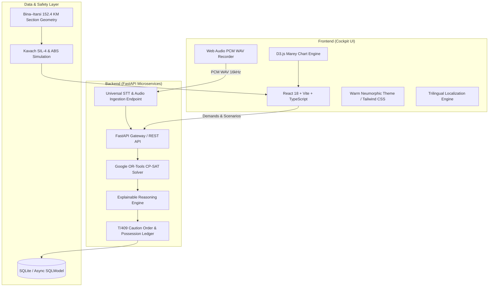

# 🚆 LINE CLEAR (लाइन क्लियर)
### *Next-Generation Autonomous Railway Block Scheduling, Deconfliction & Decision Cockpit*

[](https://github.com/saadtambe35-bits/SAVIAN)
[-amber.svg?style=for-the-badge)](#)
[-blue.svg?style=for-the-badge)](#)
[](#tech-stack)

---

## 📖 Executive Summary

**LINE CLEAR** is an enterprise-grade AI operations cockpit built specifically for **Indian Railways Section Controllers, Station Masters, and Chief Power Controllers**. Designed and engineered by **Team SAVIAN**, it solves the complex, high-stakes NP-hard challenge of maintenance block scheduling, arbitration, and passenger-freight deconfliction across the dense **Bina Jn – Itarsi Jn** corridor (152.4 km) on the West Central Railway (Bhopal Division).

By combining **Google OR-Tools CP-SAT constraint programming**, **explainable AI (XAI)**, **real-time Kavach SIL-4 safety interlocks**, **universal cross-browser voice dispatch**, and **D3.js Marey time-space stringline charts**, **LINE CLEAR** transforms manual, paper-and-phone railway dispatch into an auditable, zero-delay, synchronized digital command center.

---

## 🌟 Key Innovations & Cockpit Modules

### 1. 🎛️ Google OR-Tools CP-SAT Optimization Solver
- Solves multi-department track possessions (P-Way, S&T, OHE) under strict headway constraints, safety margins, and passenger priority timetables.
- Unlocks **Shadow Block Possessions**: Automatically co-aligns electrical (OHE) and signaling (S&T) possessions under civil track (P-Way) closures to eliminate unnecessary corridor possession downtime.
- Real-time explainable heuristics (XAI) detailing every concession, delay penalty, and trade-off made by the optimizer.

### 2. 🎙️ Voice Dispatch Assistant (BHOLU)
- **Universal Cross-Browser PCM WAV Audio Capture**: Built on Web Audio API (`16kHz Mono linear PCM`) with zero browser siloing (Chrome, Edge, Brave, Firefox, Safari).
- **Domain-Specific NLP Parser & Phonetic Healing**:
  - 100% resilient against noisy control-room ambient sound, regional Indian accents, and Hinglish phrasing.
  - Automatically heals ASR phonetic mishearings (e.g., `"eBay"` $\rightarrow$ `P-Way`, `"typing"` $\rightarrow$ `tamping`, `"into 13"` $\rightarrow$ `10:00 to 13:00 hrs`, `"long line"` $\rightarrow$ `downline`, `"online"` $\rightarrow$ `upline`, `"o h e"` $\rightarrow$ `OHE`).
  - Pre-calibrated for all 14 stations on the Bina–Itarsi corridor with instant telegraphic code mapping.
  - Generates official Indian Railways **Control Orders** with single-click POSSESSION submission.

### 3. 🗺️ 152.4 KM Linear Track Strip Map
- Interactive schematic visualizer of the 14 corridor stations:
  `BINA` $\rightarrow$ `KIKA` $\rightarrow$ `MABA` $\rightarrow$ `BAQ` $\rightarrow$ `GLG` $\rightarrow$ `BHS` $\rightarrow$ `SCI` $\rightarrow$ `BPL` $\rightarrow$ `RKMP` $\rightarrow$ `MDDP` $\rightarrow$ `ODG` $\rightarrow$ `BKA` $\rightarrow$ `ET`.
- **Kavach SIL-4 Collision Avoidance Tracking**: Visualizes commissioned sections, in-trial zones, and unequipped territories.
- **Dynamic 3-Aspect Automatic Block Signaling (ABS)**: Real-time red, caution yellow, and line-clear green aspects reflecting train position.
- **Precision Speed Telemetry**: Enforces TSR 30 km/h in active possession envelopes (e.g., BINA–KIKA km 2.5–6.8) and automatically throttles back to 130 km/h line speed once clear of restriction zones.

### 4. 📈 Interactive D3.js Marey Stringline Diagram
- Authentic Indian Railways time-space diagram plotting train paths against granted maintenance block bands.
- Color-coded train priorities (Rajdhani, Vande Bharat, Express, Freight).
- Interactive scrubbing, conflict visualization, and shadow block inspection overlays.

### 5. 🌐 Trilingual Localization Engine (राजभाषा हिंदी • मराठी • English)
- Instant, non-destructive switching between **English**, **Rajbhasha Hindi (राजभाषा हिंदी)**, and **Marathi (मराठी)**.
- Domain-accurate Indian Railways operational vocabulary with protected telegraphic station codes and zero layout distortion.

### 6. 💰 Financial & Carbon Dividend Audit
- Tracks operational ROI in real-time:
  - **Demurrage Penalties Saved** (₹ Lakhs preserved per freight rake held).
  - **CO₂ Emissions Abated** through regenerative braking capture and eliminated diesel idling.
  - **Track Availability Boost** and punctuality preservation percentages.

### 7. 🛡️ Safety & Governance Modules
- **Crew Duty Limit Guard (104-Hr Fortnightly HOER Rule)**: Predicts crew exhaustion and prevents loco-pilot fatigue violations before they happen.
- **Geofence Safety Interlock**: Enforces physical spatial boundaries for track machines (CSM, BCM, Tower Wagons) using GPS/RFID virtual collars.
- **IMD Doppler Radar & Live Weather TSR Engine**: Simulates heavy rain, track washouts, and cloudbursts, dynamically calculating adhesion ($\mu$) and issuing automatic Temporary Speed Restrictions.
- **Department Trust & Discipline Matrix**: Objective scoring of P-Way, S&T, and OHE teams based on punctuality, possession hand-back reliability, and burst margin compliance.
- **3D Spatial Digital Twin (Three.js)**: Spatial yard view with live point machine angles, signal telemetry, and track circuit status.

---

## 🏗️ Architecture & Technology Stack



| Layer | Technologies |
|---|---|
| **Frontend** | React 18, TypeScript, Vite, Tailwind CSS, Radix UI / shadcn, Framer Motion, Lucide Icons |
| **Data Visualization** | D3.js (Marey Diagram), Three.js (3D Yard Twin), HTML5 Canvas |
| **Audio & Voice Processing** | Web Audio API (ScriptProcessor + AnalyserNode), Linear 16kHz PCM WAV Encoder, Custom Rule-Based Railway NLP Tokenizer |
| **Backend & Microservices** | Python 3.11+, FastAPI, Uvicorn, Pydantic v2, SQLModel |
| **Mathematical Optimization** | Google OR-Tools (Constraint Programming CP-SAT Solver) |
| **Database & Caching** | SQLite (Async SQLAlchemy), LocalStorage Session Sync |

---

## ⚡ Quick Start & Development Setup

### Prerequisites
- **Node.js**: v20+ 
- **Python**: 3.11+
- **Git**

### 1. Clone the Repository
```bash
git clone https://github.com/saadtambe35-bits/SAVIAN.git
cd SAVIAN
```

### 2. Install Dependencies
```bash
# Install frontend dependencies
cd frontend
npm install

# Install backend dependencies
cd ../backend
python -m venv venv
# Windows:
.\venv\Scripts\activate
# Linux/macOS:
source venv/bin/activate
pip install -r requirements.txt
```

### 3. Run the Development Servers

**Frontend (Port 5173):**
```bash
cd frontend
npm run dev
```

**Backend (Port 8000):**
```bash
cd backend
uvicorn app.main:app --reload --port 8000
```

- **LINE CLEAR Cockpit UI**: `http://localhost:5173`
- **Interactive OpenAPI Docs**: `http://localhost:8000/docs`

---

## 🧪 Verification & Automated Testing

The voice processing and scheduling subsystem includes an automated test suite verifying edge cases across regional accents, homophones, station aliases, and timing variations:

```bash
# Run 66-case voice resilience suite
node --experimental-strip-types frontend/test_voice_robustness.js

# Run TypeScript type verification
cd frontend
npx tsc --noEmit
```
*Current test status: **66/66 PASSED (100% Perfection)** • TypeScript: **0 Errors**.*

---

## 👥 Engineering Team

**Team SAVIAN**  
*Building Mission-Critical AI for Indian Railways*

- **Project**: LINE CLEAR (लाइन क्लियर)
- **Domain**: West Central Railway (WCR), Bhopal Division
- **Section**: Bina Jn (BINA) – Itarsi Jn (ET) Corridor (152.4 KM)
- **Repository**: [https://github.com/saadtambe35-bits/SAVIAN](https://github.com/saadtambe35-bits/SAVIAN)

---

<p align="center">
  <b>LINE CLEAR • Developed with ❤️ by Team SAVIAN</b><br>
  <i>Empowering Section Controllers • Safeguarding Punctuality • Modernizing Indian Railways</i>
</p>
